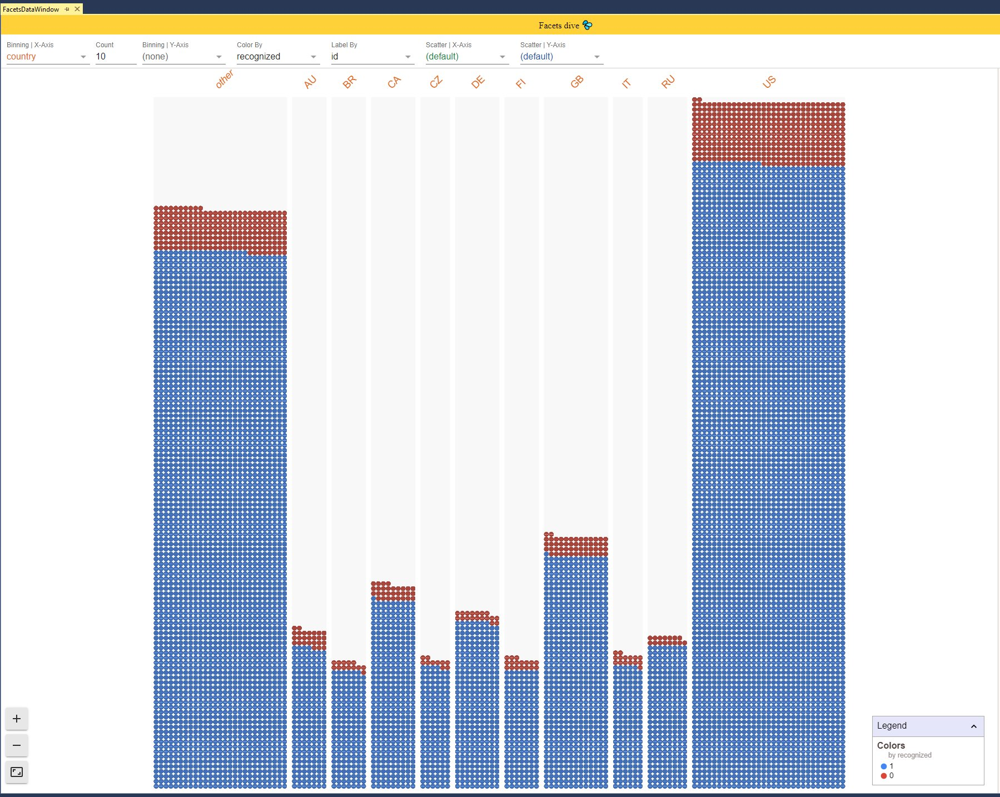
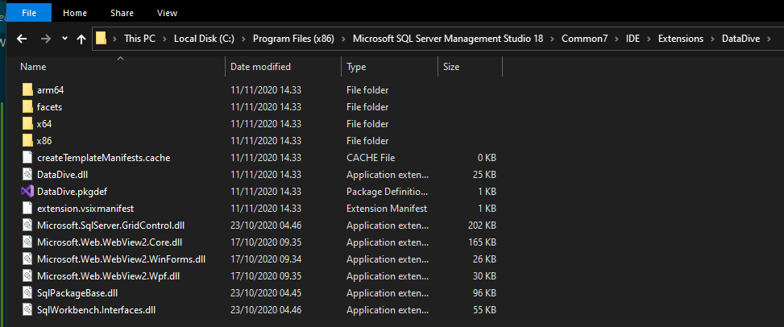

# DataDive 💦
Data viz extension for SQL Server Management Studio.

# Status [hacks 💬] 
This add-in was [hacked together](https://twitter.com/Latish/status/1326288025110908929) in a few evenings. It is very ugly written, with a ton of extensibility "hacks" still left around in the code. Run at your own risk!

# Facets Dive from Google PAIR
[Facets Dive](https://pair-code.github.io/facets/) is a super cool and useful tool for interactively exploring large amounts of data.

See more [on YouTube](https://youtu.be/WVclIFyCCOo?t=153)

## SSMS add-in
I've used Facets many times and I find it very useful to help me understand the data I'm querying from a SQL database.

The results table doesn't give you a very good idea, if any, about how lots of rows are distributed per column, if you have a lot of NULL values or how the relationship between columns are.

While it is easy enough to export a result set as CSV, go to the Facets page and load it — it would be much nicer to have it inside of management studio...

Which is what you can do with this add-in — you simply query your data as you always do, and then click `View in Facets" from the Tools menu and your result set is automatically displayed:

# Installation
Download the latest `DataDive.exe` from the [releases](https://github.com/martinnormark/DataDive/releases).

This is a self-extracting archive. Extract it to `C:\Program Files (x86)\Microsoft SQL Server Management Studio 18\Common7\IDE\Extensions` - the archive contains the `DataDive` folder.

It should look like this after correct installation:

